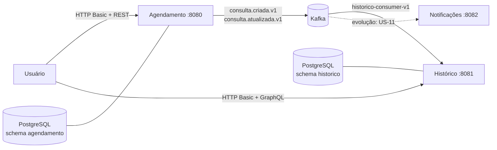
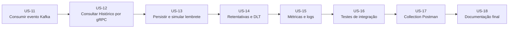
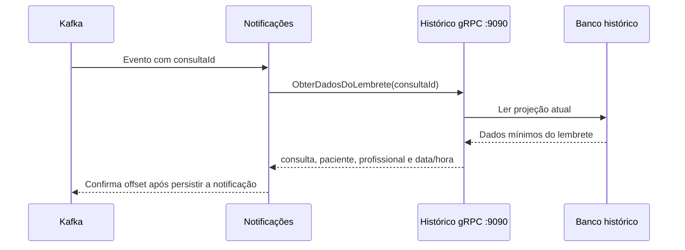

# Roteiro simples de navegação e demonstração

Use este roteiro para apresentar o projeto localmente, navegar pelos serviços e
demonstrar os fluxos que já estão disponíveis.

## 1. Iniciar e conferir o ambiente

```bash
cp .env.example .env
docker compose up --build
```

Espere os serviços ficarem saudáveis e abra:

| Recurso | Endereço | Uso |
|---|---|---|
| Serviço de agendamento | http://localhost:8080/actuator/health | Confirmar a API REST |
| Serviço de histórico | http://localhost:8081/actuator/health | Confirmar a API GraphQL |
| Serviço de notificações | http://localhost:8082/actuator/health | Confirmar a aplicação de notificações |
| Kafka UI | http://localhost:8085 | Observar tópicos e consumer groups |

## 2. Visão do fluxo



O histórico é uma projeção de leitura com consistência eventual. Depois de
criar ou alterar uma consulta, aguarde alguns instantes antes de consultá-la
no GraphQL.

## 3. Credenciais de demonstração

Todas as contas usam a senha `fiap-dev-2026` no perfil `dev`.

| Perfil | Usuário | Para demonstrar |
|---|---|---|
| Médico | `medico.demo` | Cadastro, criação/alteração e histórico de pacientes |
| Enfermeiro | `enfermeiro.demo` | Cadastro, criação/alteração e histórico de pacientes |
| Paciente | `maria.demo` | Consulta das próprias consultas |

## 4. Roteiro principal

### Passo 1 — Verificar autenticação

No Postman, execute **Agendamento - Health e segurança > Médico autenticado**.
O retorno deve ser `200 OK` e informar o perfil `MEDICO`.

Também execute **Paciente não cria consulta (403)**. Isso demonstra que a
autorização não está limitada apenas à rota REST.

### Passo 2 — Criar e alterar uma consulta

Execute, nesta ordem, a pasta **Agendamento - Fluxo principal** da collection:

1. `Cadastrar paciente`;
2. `Criar consulta`;
3. `Alterar consulta`.

Essas chamadas usam `POST /api/pacientes`, `POST /api/consultas` e
`PUT /api/consultas/{id}` no serviço de agendamento. A criação e a alteração
publicam eventos no Kafka.

### Passo 3 — Ver o evento e a projeção

Abra o Kafka UI, localize os tópicos `consulta.criada.v1` e
`consulta.atualizada.v1` e confirme o consumer group
`historico-consumer-v1`.

Em seguida, execute no Postman:

- **GraphQL - Histórico da Maria** para todo o histórico paginado;
- **GraphQL - Consultas futuras da Maria** para consultas futuras;
- **GraphQL - Minhas consultas (paciente)** autenticando como `maria.demo`.

### Passo 4 — Demonstrar a proteção de dados

No GraphQL do histórico:

- `historicoDoPaciente` e `consultasFuturas` são permitidas somente a
  `MEDICO` e `ENFERMEIRO`;
- `minhasConsultas` é permitida somente a `PACIENTE`;
- `minhasConsultas` não recebe `pacienteId`: o vínculo vem do usuário
  autenticado;
- a resposta do paciente não contém `pacienteId`.

Uma tentativa de perfil não autorizado resulta em erro `FORBIDDEN`; erros da
execução GraphQL expõem códigos em `errors[].extensions.code`.

## 5. Queries GraphQL para teste manual

Use `POST http://localhost:8081/graphql`, cabeçalho
`Content-Type: application/json` e HTTP Basic correspondente ao perfil.

Histórico de um paciente, como médico ou enfermeiro:

```graphql
query {
  historicoDoPaciente(
    pacienteId: "20000000-0000-0000-0000-000000000001"
    pagina: 0
    tamanho: 20
  ) {
    consultas { consultaId medico especialidade dataHora status }
    pagina
    totalElementos
  }
}
```

Próprias consultas, como paciente:

```graphql
query {
  minhasConsultas(somenteFuturas: true, pagina: 0, tamanho: 20) {
    consultas { consultaId medico especialidade dataHora status }
    pagina
    totalElementos
  }
}
```

## 6. Mapa de histórias disponíveis

| Área | Histórias demonstráveis | Onde navegar |
|---|---|---|
| Ambiente e acesso | US-01, US-01A, US-01B, US-02, US-03 | Docker Compose, health checks e Postman |
| Agendamento | US-04, US-05, US-06, US-07 | API REST em `:8080` e Kafka UI |
| Histórico | US-08, US-09, US-10 | GraphQL em `:8081` |
| Próximas etapas | US-11 a US-18 | Roteiro de evolução abaixo |

Para os requests prontos, importe
[`postman/Tech-Challenge-Fase-3.postman_collection.json`](../postman/Tech-Challenge-Fase-3.postman_collection.json).

## 7. Roteiro de evolução — US-11 a US-18

Esta seção organiza a próxima etapa de implementação e apresentação. No estado
atual, o contrato Protobuf da US-12 já existe, mas o consumidor de notificações
e o servidor gRPC ainda não foram implementados. Portanto, a porta `9090` não
deve ser usada como se já estivesse disponível.



### US-11 — Consumir eventos para notificação

1. Criar no `servico-notificacao` um consumidor para os tópicos
   `consulta.criada.v1` e `consulta.atualizada.v1`.
2. Configurar o consumer group `notificacao-consumer-v1` e confirmação de
   offset somente depois do processamento bem-sucedido.
3. Criar a tabela de notificações no schema `notificacao`, com `eventId` único,
   para garantir idempotência.
4. Confirmar no Kafka UI a leitura dos eventos e o consumer group ativo.

Resultado esperado: cada evento válido produz um registro de notificação, sem
duplicar registros quando a mensagem é reprocessada.

### US-12 — Buscar dados atuais por gRPC

O contrato atual está em
[`contratos-grpc/src/main/proto/historico_notificacao.proto`](../contratos-grpc/src/main/proto/historico_notificacao.proto).
Ele define o serviço interno `HistoricoNotificacaoService` e a operação
`ObterDadosDoLembrete`:



Sequência de implementação:

1. Adicionar o servidor gRPC ao `servico-historico`, na porta interna `9090`,
   implementando `ObterDadosDoLembrete`.
2. Consultar a projeção `ConsultaHistorico` pelo `consultaId`; retornar somente
   `consultaId`, nome/e-mail do paciente, profissional, especialidade,
   data/hora e status.
3. Configurar o cliente do `servico-notificacao` com o stub gerado pelo módulo
   `contratos-grpc`, deadline configurável, retentativas limitadas e circuit
   breaker.
4. Proteger a comunicação interna com autenticação adequada e expor `9090`
   apenas na rede interna do Docker Compose, nunca ao cliente final.
5. Manter o offset Kafka pendente enquanto a consulta gRPC ou a persistência da
   notificação falhar.

Depois de implementar e iniciar a US-12, valide manualmente com:

```bash
grpcurl -plaintext \
  -import-path contratos-grpc/src/main/proto \
  -proto historico_notificacao.proto \
  -d '{"consulta_id":"30000000-0000-0000-0000-000000000001"}' \
  localhost:9090 \
  fiap.techchallenge.historico.v1.HistoricoNotificacaoService/ObterDadosDoLembrete
```

> O comando é um roteiro futuro: antes da implementação da US-12, a conexão a
> `localhost:9090` deve falhar porque não há servidor gRPC exposto.

### US-13 — Gerar o lembrete

1. Formatar o lembrete com nome do paciente, profissional, especialidade e
   data/hora no fuso configurado.
2. Persistir o resultado com status `RECEBIDA`, `ENVIADA` ou `FALHA`.
3. Na primeira versão, simular o envio por log; não incluir observações
   médicas no texto ou no log.

### US-14 — Falhas, retentativas e DLT

1. Aplicar backoff para falhas transitórias no consumidor Kafka e no cliente
   gRPC.
2. Não repetir indefinidamente falhas de validação ou dados inválidos.
3. Após o limite, publicar a mensagem em um tópico `.DLT` e registrar
   `eventId`, `consultaId` e o motivo da falha.
4. Documentar no README como inspecionar e reprocessar uma DLT pelo Kafka UI.

### US-15 — Saúde e observabilidade

1. Validar `GET /actuator/health` em todos os serviços.
2. Incluir logs estruturados com serviço, `eventId`, `consultaId` e resultado,
   sem dados sensíveis.
3. Expor métricas para publicação, consumo, falhas, retentativas e lag dos
   consumer groups.

### US-16 — Testes críticos

Execute `./gradlew test` como verificação mínima. Na evolução, acrescentar:

- integração PostgreSQL e Kafka com Testcontainers;
- integração GraphQL para histórico;
- integração gRPC para `ObterDadosDoLembrete`;
- cenários de `401`, `403`, validação, idempotência, DLT e paciente tentando
  acessar dados de outra pessoa.

### US-17 — Collection Postman

Atualizar a collection com health checks, as três credenciais de demonstração,
cenários de acesso negado e evidências de mensageria. O gRPC não é executado
diretamente pelo Postman; manter o comando `grpcurl` como evidência do contrato
e do endpoint interno.

### US-18 — Fechamento da documentação

Antes da entrega, revisar README, collection e este roteiro para documentar:

- contratos REST, GraphQL, Kafka e gRPC;
- consistência eventual da projeção de histórico;
- autenticação, autorização e proteção de dados;
- timeouts, circuit breaker, retentativas, DLT e procedimento de reprocessamento;
- ausência de credenciais reais no repositório.
