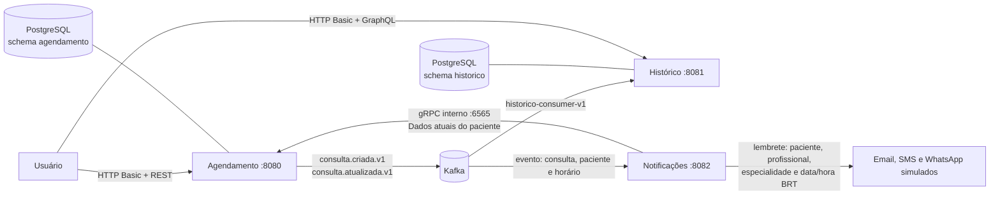
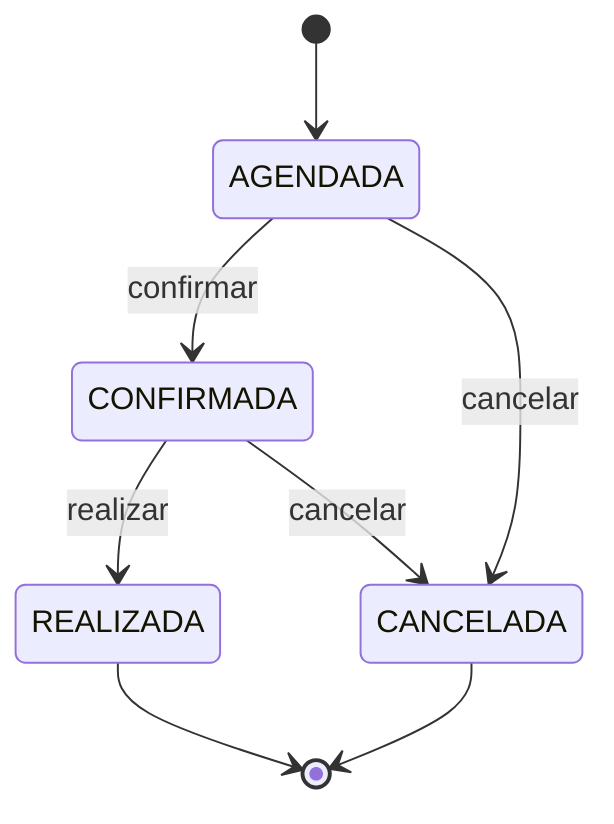
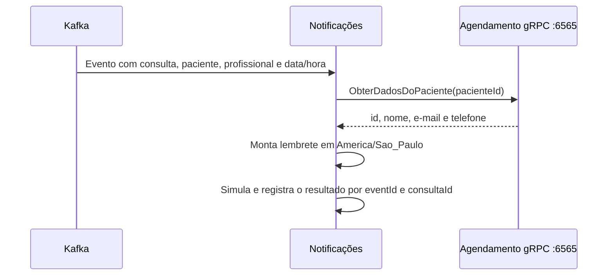

# Roteiro simples de navegação e demonstração

Use este roteiro para apresentar o projeto localmente, navegar pelos serviços e
demonstrar os fluxos que já estão disponíveis.

## 1. Iniciar e conferir o ambiente

```bash
cp .env.example .env
docker compose up --build
```

Espere os serviços ficarem saudáveis e abra:

| Recurso | Endereço | Uso |
|---|---|---|
| Serviço de agendamento | http://localhost:8080/actuator/health | Confirmar a API REST |
| Serviço de histórico | http://localhost:8081/actuator/health | Confirmar a API GraphQL |
| Serviço de notificações | http://localhost:8082/actuator/health | Confirmar a aplicação de notificações |
| Kafka UI | http://localhost:8085 | Observar tópicos e consumer groups |

## 2. Visão do fluxo



O histórico é uma projeção de leitura com consistência eventual. Depois de
criar ou alterar uma consulta, aguarde alguns instantes antes de consultá-la
no GraphQL.

O ciclo de vida da consulta é:



## 3. Credenciais de demonstração

Todas as contas usam a senha `fiap-dev-2026` no perfil `dev`.

| Perfil | Usuário | Para demonstrar |
|---|---|---|
| Médico | `medico.demo` | Cadastro, criação/alteração e histórico de pacientes |
| Enfermeiro | `enfermeiro.demo` | Cadastro, criação/alteração e histórico de pacientes |
| Paciente | `maria.demo` | Consulta das próprias consultas |

## 4. Roteiro principal

### Passo 1 — Verificar autenticação

No Postman, execute **Agendamento - Health e segurança > Médico autenticado**.
O retorno deve ser `200 OK` e informar o perfil `MEDICO`.

Também execute **Paciente não cria consulta (403)**. Isso demonstra que a
autorização não está limitada apenas à rota REST.

### Passo 2 — Criar, alterar e atualizar o status de uma consulta

Execute, nesta ordem, a pasta **Agendamento - Fluxo principal** da collection:

1. `Cadastrar paciente`;
2. `Criar consulta`;
3. `Alterar consulta`.
4. `Atualizar status da consulta`, enviando a versão retornada no passo anterior.

Essas chamadas usam `POST /api/pacientes`, `POST /api/consultas` e
`PUT /api/consultas/{id}` e `PATCH /api/consultas/{id}/status` no serviço de
agendamento. A criação, a alteração e a mudança de status publicam eventos no
Kafka.

### Passo 3 — Ver o evento e a projeção

Abra o Kafka UI, localize os tópicos `consulta.criada.v1` e
`consulta.atualizada.v1` e confirme o consumer group
`historico-consumer-v1`.

Em seguida, execute no Postman:

- **GraphQL - Histórico da Maria** para todo o histórico paginado;
- **GraphQL - Consultas futuras da Maria** para consultas futuras;
- **GraphQL - Minhas consultas (paciente)** autenticando como `maria.demo`.

### Passo 4 — Demonstrar a proteção de dados

No GraphQL do histórico:

- `historicoDoPaciente` e `consultasFuturas` são permitidas somente a
  `MEDICO` e `ENFERMEIRO`;
- `minhasConsultas` é permitida somente a `PACIENTE`;
- `minhasConsultas` não recebe `pacienteId`: o vínculo vem do usuário
  autenticado;
- a resposta do paciente não contém `pacienteId`.

Uma tentativa de perfil não autorizado resulta em erro `FORBIDDEN`; erros da
execução GraphQL expõem códigos em `errors[].extensions.code`.

## 5. Queries GraphQL para teste manual

Use `POST http://localhost:8081/graphql`, cabeçalho
`Content-Type: application/json` e HTTP Basic correspondente ao perfil.

Histórico de um paciente, como médico ou enfermeiro:

```graphql
query {
  historicoDoPaciente(
    pacienteId: "20000000-0000-0000-0000-000000000001"
    pagina: 0
    tamanho: 20
  ) {
    consultas { consultaId medico especialidade dataHora status }
    pagina
    totalElementos
  }
}
```

Próprias consultas, como paciente:

```graphql
query {
  minhasConsultas(somenteFuturas: true, pagina: 0, tamanho: 20) {
    consultas { consultaId medico especialidade dataHora status }
    pagina
    totalElementos
  }
}
```

## 6. Mapa de histórias disponíveis

| Área | Histórias demonstráveis | Onde navegar |
|---|---|---|
| Ambiente e acesso | US-01, US-01A, US-01B, US-02, US-03 | Docker Compose, health checks e Postman |
| Agendamento | US-04, US-05, US-06, US-07 | API REST em `:8080` e Kafka UI |
| Histórico | US-08, US-09, US-10 | GraphQL em `:8081` |
| Notificações, qualidade e entrega | US-11 a US-18 | Kafka UI, gRPC interno, testes, Postman e documentação |

Para os requests prontos, importe
[`postman/Tech-Challenge-Fase-3.postman_collection.json`](../postman/Tech-Challenge-Fase-3.postman_collection.json).

## 7. Notificações e consulta de paciente por gRPC

O `servico-notificacao` consome os eventos de consulta com o consumer group
`notificacao-consumer-v1`. Para cada evento processado, ele busca os dados
atuais do paciente no `servico-agendamento` por gRPC e só então aciona os
canais de notificação. Assim, nome, e-mail e telefone não precisam viajar no
evento Kafka nem ser buscados diretamente no banco de outro serviço.
O lembrete inclui nome do paciente, profissional, especialidade e data/hora em
`America/Sao_Paulo`; consultas passadas, canceladas ou realizadas não são
enviadas.



O contrato está em
[`contratos-grpc/src/main/proto/pacientes.proto`](../contratos-grpc/src/main/proto/pacientes.proto)
e define `BuscaPacienteById.ObterDadosDoPaciente`. A chamada recebe
`pacienteId` e retorna somente `pacienteId`, nome, e-mail e telefone. A porta
`6565` é interna à rede Docker; no ambiente local de demonstração ela também é
publicada somente em `127.0.0.1:6565` para o teste gRPC pelo Postman.

Para demonstrar o fluxo, crie ou altere uma consulta no passo 2, espere o
consumo e confira no Kafka UI o grupo `notificacao-consumer-v1`. O gRPC é uma
integração interna. Para exercitar o servidor localmente no Postman, importe o
contrato canônico [`pacientes.proto`](../contratos-grpc/src/main/proto/pacientes.proto)
e siga o roteiro em [`README.md — Testes manuais com Postman`](../README.md#testes-manuais-com-postman).

Execute todos os testes com:

```bash
./gradlew test
```
